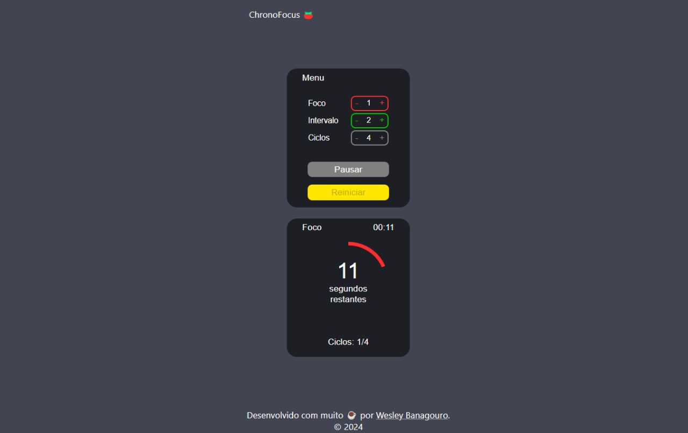

# ChronoFocus

- [Link para o ChronoFocus](https://wesleybanagouro.github.io/ChronoFocus/)

Bem-vindo ao ChronoFocus, um aplicativo Pomodoro elegante e eficiente projetado para ajudar você a aumentar a produtividade e gerenciar seu tempo de forma eficaz. Construído com HTML, CSS e JavaScript puros, o ChronoFocus oferece uma interface minimalista com todos os recursos essenciais que você precisa para implementar a Técnica Pomodoro em sua rotina diária.

## Funcionalidades

- **Interface Simples e Intuitiva**: Um design limpo que permite focar nas suas tarefas sem distrações.
- **Temporizadores Personalizáveis**: Defina as durações preferidas para as sessões de trabalho e pausas.
- **Alertas Sonoros**: Receba notificações quando for hora de fazer uma pausa ou começar uma nova sessão.
- **Rastreamento de Progresso**: Indicadores visuais de progresso para mantê-lo informado sobre o status da sua sessão.
- **Design Responsivo**: Funciona perfeitamente tanto em dispositivos desktop quanto móveis.

## Capturas de Tela

